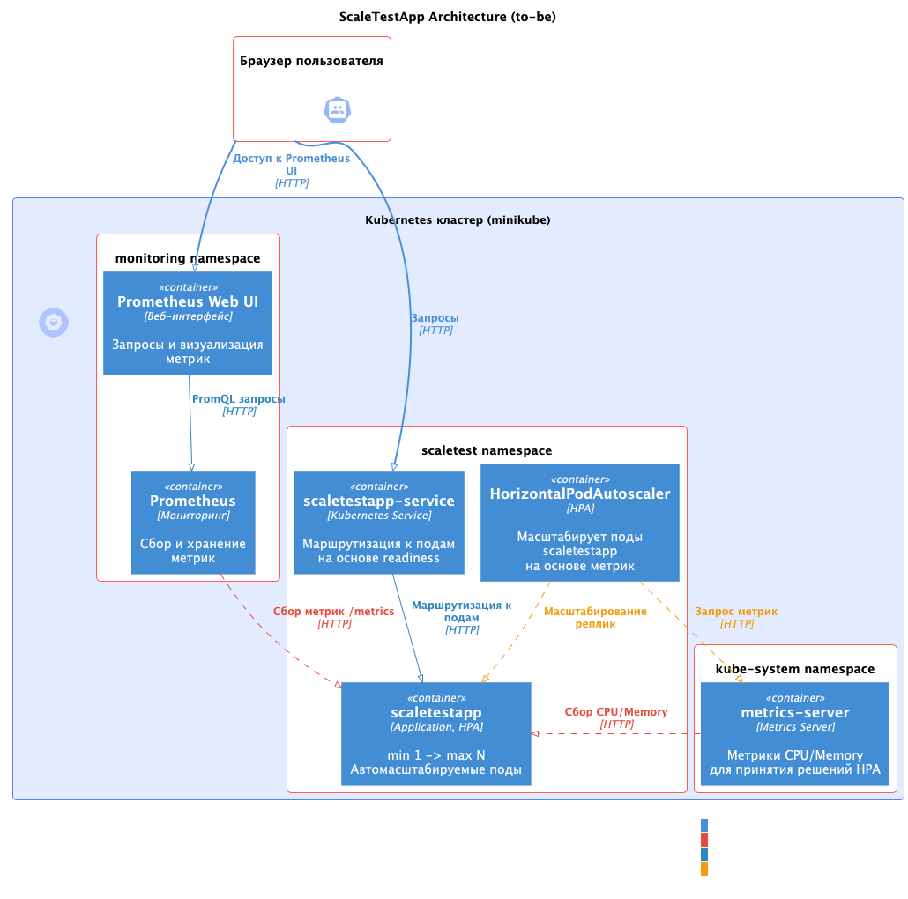
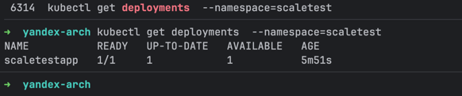
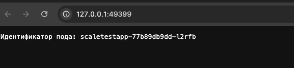
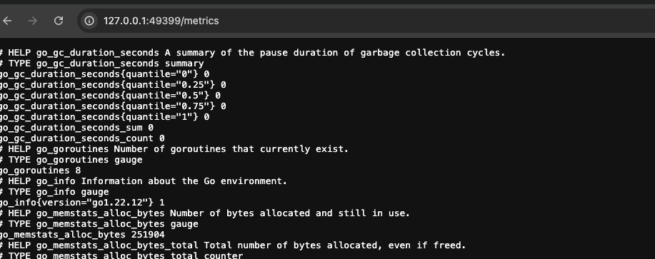
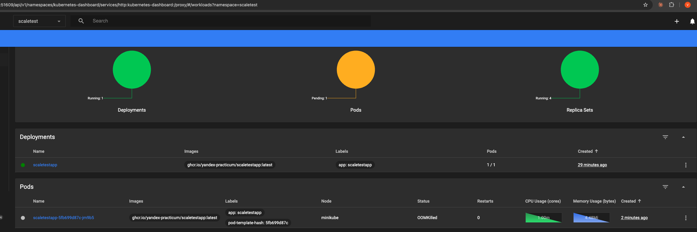
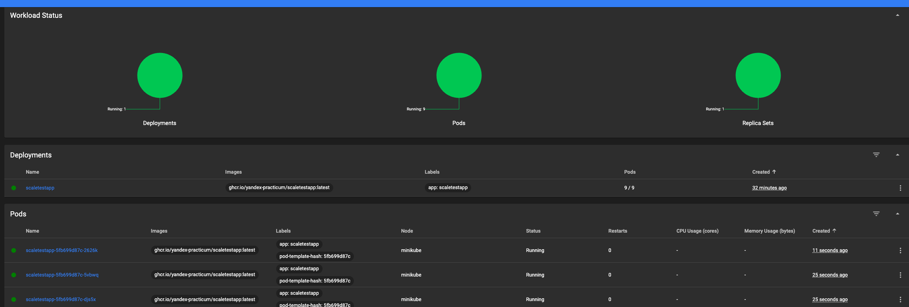
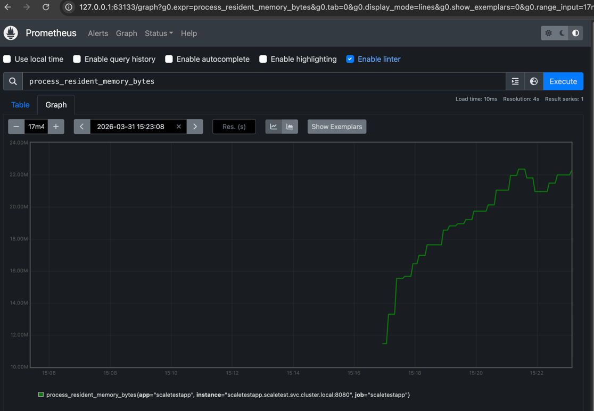
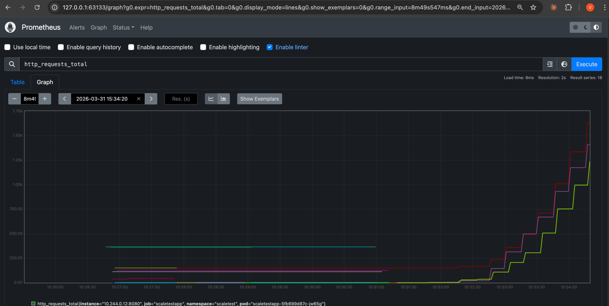
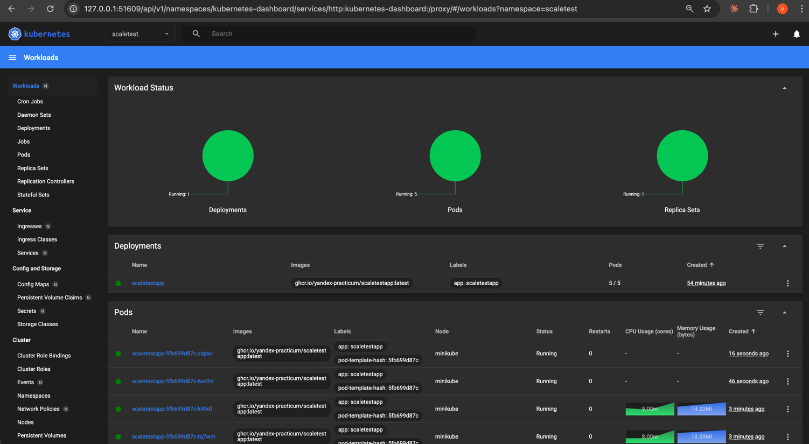
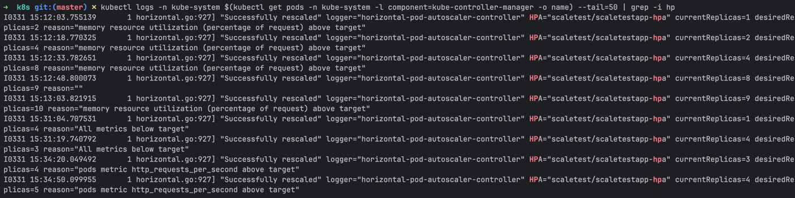

### Схема реализации

### Файлы маинфестов 

[k8s](k8s)

### Скриншоты выполнения задания

#### Поднятие приложения в кластере и верификация его работы

####  Тестирование HPA по Memory utilisation;

(Для скейлинга было установлено значение в 10Mi)

####  Поднятие Prometheus и его тестирование

####  Результат работы HPA по RPS

