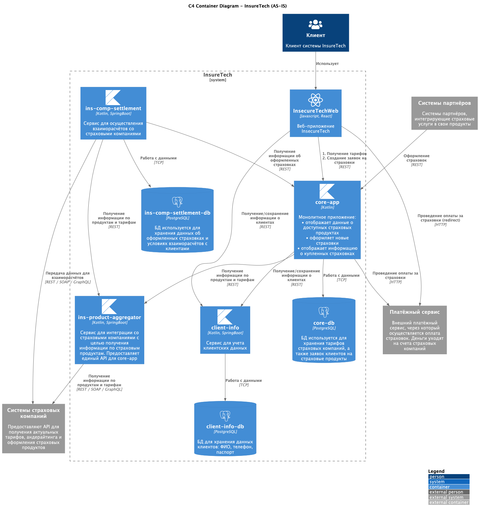
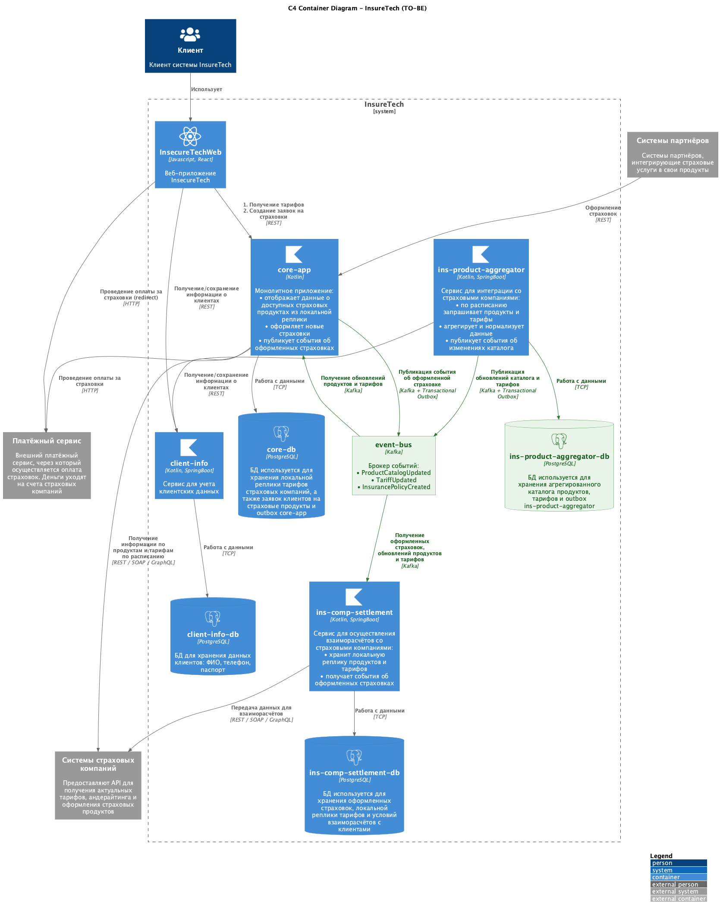

## Проблемы текущей архитектуры

- ins-product-aggregator отвечает синхронно и во время каждого запроса обходит все страховые компании. при росте с 5 до 10 интеграций время ответа и вероятность ошибки заметно вырастут.
- Один меденный или недоступный api страховой компании замедляет или ломает ответ целиком для внутренних сервисов
- ins-comp-settlement получает оформленные страховки из core-app только раз в сутки по rest. Если ночной обмен завершится с ошибкой, реестр будет неполным.
- Один и тот же каталог продуктов многократно запрашивается заново, поэтому растет лишняя нагрузка и на `ins-product-aggregator`, и на API страховых компаний.
- сервисы слишком сильно зависят от доступности друг друга в конкретный момент времени. Это повышает число таймаутов и ретраев.

## Простое целевое решение

- ins-product-aggregator не отдает каталог продуктов через синхронный fan-out запрос. Вместо этого он по расписанию получает данные из страховых компаний, сохраняет нормализованный каталог у себя и публикует события в брокер.
- core-app и `ins-comp-settlement подписываются на события ProductCatalogUpdated и TariffUpdated и обновляют свои локальные реплики асинхронно
- core-app после оформления страховки публикует событие InsurancePolicyCreated.
- ins-comp-settlement получает оформленные страховки из событий, а не забирает их раз в сутки по rest из core-app.

## Transactional Outbox

Использовать Transactional Outbox стоит:
- core-app - чтобы сохранение оформленной страховки и публикация InsurancePolicyCreated не расходились между собой.

## Диаграммы

AS IS:

TO BE: 

