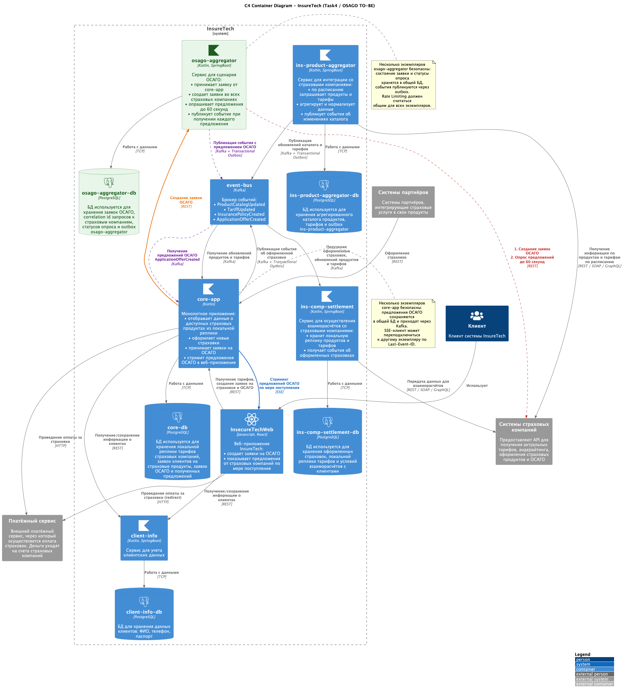

Решения:
- Необходимо реализовать Rate Limiter на создания заявок ОСАГО чтобы, не выйти за доступные лимиты страховых компаний
- Необходимо запрашивать преждложения от страховых компаний асинхронно, и стримить статус пользователю чтобы отображать результаты по мере их получения для лучшего UX
- Для лучшего UX создание заявки ОСАГО во внешних страховых компаниях будет совершаться асинхронно. Для этого osago-aggregator требуется хранилише для реализации паттерная transactional outbox
- osago-aggregator предоставляет REST API создания заявки, и отправки события ApplicationOfferCreated (на получение ответа от каждой из страховых компаний)
- необходим circuit braker от `osago-aggregator` на случай если сервисы страховых компаний не работают, чтобы сократить бессмысленную нагрузку на внутренние сервисы
- необходимо добавить SSE в core-app, чтобы после создания заявки, и получения офферов core-app стримил результаты

